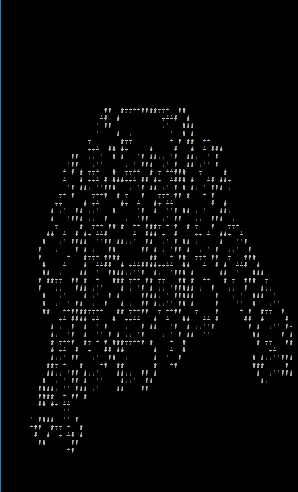

# Langton's Ant

A simulation of Langton's Ant in c++. The user can enter the dimentionas of the board, and an Ant (represented by "*" will be placed 
on the board. The movement of the Ant follows these rules:
    1) If the ant is on a white space, turn right 90 degrees and change the space to black (represented by "#").
    2) If the ant is on a black space, turn left 90 degrees and change the space to white (represented by " ").
    
    

## Instructions for Running
1) Installation:
```
git clone https://github.com/hahmed01/Langton-Ant
```
1) Complile using:
```
make
```
2) Run using
```
LangtonAnt
```
```
## Images of Running Langton's Ant
![Entering dimensions]{images/LangtonAnt1.jpg)


